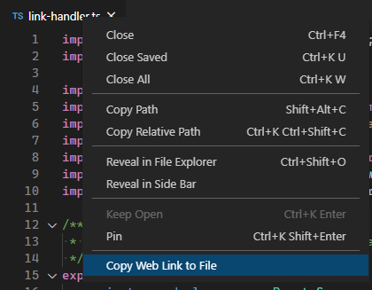
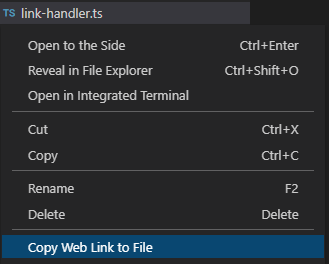
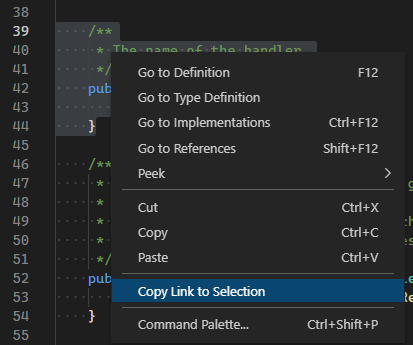

# Git Web Links for VS Code

Copy links to files in their online Git repositories from inside Visual Studio Code.

Works with:

-   GitHub
-   GitHub Enterprise
-   Bitbucket Server
-   Bitbucket Cloud
-   Visual Studio Team Services
-   Azure Dev Ops

For GitHub Enterprise and Bitbucket Server, there is some configuration required. [See below for more details](#github-enterprise-and-bitbucket-server).

## Copy Link to File

To copy a link to the file on GitHub (or Bitbucket), right-click on the file's tab and select _Copy Web Link to File_.



You can also right-click on a file in Explorer panel and select _Copy Web Link to File_.



## Copy Link to Selection

To copy a link to a particular line in the file, right-click on the line in the editor and select _Copy Web Link to Selection_.

If you want to copy a link to a range of lines, just select the lines first.



## Link Format

Links can be created using the current commit hash, or the current branch name. The current commit hash is the default format. This can be changed using the setting `gitweblinks.linkType`. You can specify either `"branch"` or `"hash"` as the value.

```json
"gitweblinks.linkType": "hash"
```

## GitHub Enterprise and Bitbucket Server

If you use GitHub Enterprise or Bitbucket Server, you will need to tell the extension the URLs of those servers. Do this in your user settings file (_File -> Preferences -> Settings_). You need to specify the base HTTP/HTTPS URL of the server, and if you use SSH, the base SSH URL.

Make sure you include any port numbers (if it's not port 80) and context paths.

### GitHub Enterprise

```json
"gitweblinks.gitHubEnterprise": [
    {
        "baseUrl": "https://local-github",
        "sshUrl": "git@local-github"
    }
]
```

### Bitbucket Server

```json
"gitweblinks.bitbucketServer": [
    {
        "baseUrl": "https://local-bitbucket:7990/context",
        "sshUrl": "git@local-bitbucket:7999"
    }
]
```

## Commands

There are two commands provided by this extension:

-   `gitweblinks.copyFile`
-   `gitweblinks.copySelection`

## Requirements

This extension requires Git to already be installed and on your PATH. If this isn't suitable for you and you'd prefer to specify the location of Git, please open a new issue in this repository and I'll see what I can do :)

## Release Notes

## 1.4.1

-   Fixed selection ranges in Azure DevOps.

### 1.4.0

-   Added support for Azure DevOps.

### 1.3.1

-   Dependency updates.

### 1.3.0

-   Used VS Code's clipboard API. No longer requires `xclip` on Linux!

### 1.2.3

-   Dependency updates.

### 1.2.1

-   Added support for Visual Studio Team Services repositories in collections.

### 1.2.0

-   Added the ability to generate links using the current branch name of current commit hash.
-   Added support for Visual Studio Team Services.
-   Fixed a bug that would create the wrong URL when there was a space in the file path.

### 1.1.1

-   Added support for multi-root workspaces.

### 1.0.0

-   Initial release
