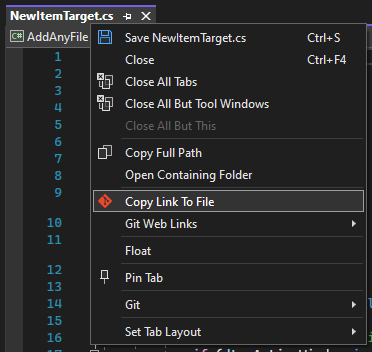

# Git Web Links for Visual Studio 2022

Copy links to files in their online Git repositories from inside Visual Studio 2022.

Works with:

-   Azure DevOps Cloud and Server
-   Bitbucket Cloud and Server
-   GitHub and GitHub Enterprise
-   Gitiles (Gerrit)
-   GitLab (SaaS, Community Edition and Enterprise Edition)
-   Visual Studio Team Services

For on-premise hosts (for example, GitLab CE, Bitbucket Server, etc), there is some configuration required. [See below for more details](#on-premise-servers).

## Copy a Link to a File

To copy a link to the file, right-click on the file's tab and select _Copy Link to File_.

You can also right-click on a file in _Solution Explorer_ and select _Copy Link to File_.

## Copy a Link to the Selection

To copy a link to a particular line in the file, right-click on the line in the editor and select _Copy Link to Selection_.

If you want to copy a link to a range of lines, just select the lines first.

## Default Link Format

The commands above will create links using either the current commit hash, the current branch name or the default branch name.

The current commit hash is the default format. This can be changed in _Tools -> Options -> Git Web Links -> General_.

The default branch is found by using the remote's `HEAD` ref (for example, `origin/HEAD`), but you can specify a specific branch name to use as the default.

## Open in Browser

You can choose to open the links directly in the browser instead of copying to the clipboard. The menu item is hidden by default, but you can change it in _Tools -> Options -> Git Web Links -> General_.

## On-Premise Servers

If you use an on-premise server, you will need to specify the URLs of those servers in _Tools -> Options -> Git Web Links_. You need to specify the base HTTP/HTTPS URL of the server, and if you use SSH, the base SSH URL.

Make sure you include any port numbers (if it's not port 80) and context paths.

The supported on-premise services are:

-   Azure DevOps Server
-   Bitbucket Server
-   GitHub Enterprise
-   Gitiles
-   GitLab Enterprise/Community Edition

## Requirements

This extension requires Git to already be installed and on your PATH.

## Which Link Format Should I Use?

There are three types of links that can be produced, and each have their advantages and disadvantages.

### `commit`

This is the default format, and will create a link using the current commit's hash.

This is great for producing permalinks, but it can lead to 404s if your current commit hasn't been pushed to the remote.

### `branch`

This will create a link using the name of the branch that is currently checked out.

This is good if you only need the link to be useful for a short period of time (for example, sharing a link via email or instant messaging), but it's not great for producing permalinks - if the code on that branch changes in the future, the link maybe become invalid.

### `defaultBranch`

This will create a link using the name of the default branch, rather than the name of the branch that is currently checked out. The name of the default branch is discovered using the remote's `HEAD` ref, but you can also choose a specific branch name to use by setting the `gitweblinks.defaultBranch` setting.

Like the "branch" type, this type of link is also useful for sharing via email or instant messaging, but because it uses the default branch name rather than the name of the current branch, it's particularly useful if you've created a branch locally that does not exist on the server.

The only caveat with this type of link is that the code on the branch that is currently checked out _might_ be different to the code on the default branch, which may lead to an invalid link.
